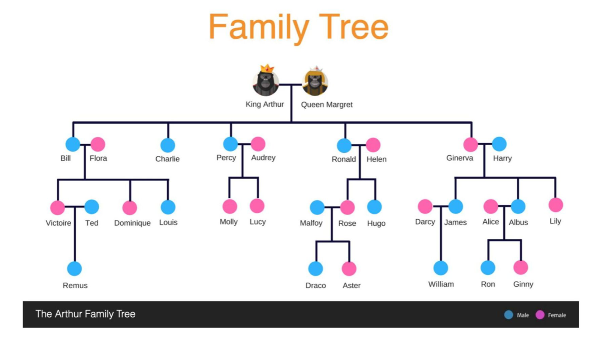

# shippit-coding-challenge

My submission to the Shippit Coding Challenge, implemented in Ruby v3.3.5, is a small application to manage the following family tree of King Arthur and Queen Margaret:



The application accepts an action file where each line denotes an action to perform on the family tree.

Example: `./ruby family_tree.rb /path/to/actions.txt`

**Supported Actions**

- `ADD_CHILD [MOTHER'S NAME] [CHILD'S NAME] [CHILD'S GENDER]`
- `GET_RELATIONSHIP [PERSON'S NAME] [RELATIONSHIP TYPE]`

> Note that you can only add a child via the mother

**Supported Genders**

- `MALE`
- `FEMAL`

**Supported Relationship Types**

- `MOTHER`
- `FATHER`
- `SIBLINGS`
- `CHILD`
- `DAUGHTER`
- `SON`
- `PATERNAL-UNCLE`
- `MATERNAL-UNCLE`
- `PATERNAL-AUNT`
- `MATERNAL-AUNT`
- `SISTER-IN-LAW`
- `BROTHER-IN-LAW`

**Comments and Blank Lines**

Blank lines and lines starting with `#` are ignored.

**Example `actions.txt` File**

Based on the family tree of King Arthur and Queen Margaret, here is an example action file:

```txt
# Adding Children
ADD_CHILD "Queen Margaret" "Jonathan" "Male"

# Getting relationships
GET_RELATIONSHIP Remus Maternal-Aunt
```

> Note that quotation marks are only required if the name of the person has a space in it, if quotation marks are ommitted the action will fail.\
> Also, note that the **gender** and **relationship-types** are **case-insensitive**.

**Output**

Based on the family tree, here are the expected outputs for commoon scenarios:

| Action                                          | Output                  | Comments                    |
| ----------------------------------------------- | ----------------------- | --------------------------- |
| `ADD_CHILD "Queen Margaret" "Jonathan" "Male"`  | `CHILD_ADDED`           | Successful                  |
| `ADD_CHILD "Betty" "Jonathan" "Male"`           | `PERSON_NOT_FOUND`      | Betty doesn't exist         |
| `ADD_CHILD "Queen Margaret" "Jonathan" "Other"` | `CHILD_ADDITION_FAILED` | Invalid gender              |
| `ADD_CHILD "King Arthur" "Jonathan" "Other"`    | `CHILD_ADDITION_FAILED` | Father's name provided      |
| `ADD_CHILD "King Arthur"`                       | _no output_             | Invalid number of arguments |
| `ADD_CHILD "King Arthur" "Jonathan"`            | _no output_             | Invalid number of arguments |
| `ADD_PET "King Arthur" "Poodles"`               | _no output_             | Invalid action, `ADD_PET`   |
| `GET_RELATIONSHIP "Percy" "Child"`              | `Molly Lucy`            | Names of children           |
| `GET_RELATIONSHIP "Charlie" "Child"`            | `NONE`                  | Charlie has no children     |
| `GET_RELATIONSHIP "Betty" "Child"`              | `PERSON_NOT_FOUND`      | Betty doesn't exist         |
| `GET_RELATIONSHIP "King Arthur" "Pets"`         | _no output_             | Invalid relationship type   |
| `GET_RELATIONSHIP "King Arthur"`                | _no output_             | Invalid number of arguments |

## Approach

### Data Model

The data model revolves around four primary classes: `FamilyTree`, `FamilyFactory`, `Family`, and `Person`.

#### `FamilyTree`

Represents the entire family tree and ensures a single instance throughout the application using the Singleton pattern.\\
It manages a collection of `Family` objects and the retrieval of various family relationships such as parents, uncles, aunts, and children.

#### `FamilyFactory`

Responsible for creating and initializing predefined families. It uses helper methods to find or create individuals and establish relationships between them.

#### `RelationshipManager`

Manages the relationships between individuals, ensuring that connections like spouses, parents, and siblings are correctly established and maintained.

#### `Family`

Represents a family unit which is made up of a mother (`Person`), father (`Person`), and children (an array of `Person` objects).

#### `Person`

Represents an individual within the family tree, holding personal information and a reference to their spouse. A `Person` can exist in multiple families - as a **child** of one and as a **parent** (mother or father) of another.

## Dependencies

This project requires the following dependencies:

- Ruby 3.3.5
- Bundler (for managing gem dependencies)

Make sure to install Bundler if you haven't already:

```sh
gem install bundler
```

## Usage

To run the application with a custom `actions.txt` file, you can specify the path to your custom file. For example:

```sh
ruby ./bin/family_tree.rb ./path/to/your/actions.txt
```

This will execute the actions specified in your custom `actions.txt` file.

Alternatively, you can use the Rake task `rake run` to run the application with the included `./data/actions.txt` file:

```sh
rake run
```

## Testing

To run the tests, you can use the Rake tasks defined in the `Rakefile`. Use the following command to run all tests:

```sh
rake test
```

This will execute all the RSpec tests in the `spec` directory.
